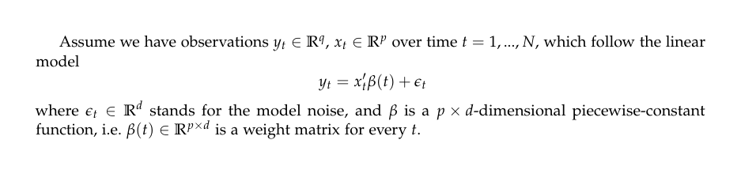

# DataGeneration
This application is a nice tool for generating data having multivariate linear structure under different conditions. In general, multivariate linear structure assumes that there are several dependent and a set of independent variables, and the dependency between them is linear. Mathematically, the model looks the following way (https://aaltodoc.aalto.fi/handle/123456789/34656):

<p align="center">
  
</p>

There are quite many variables that could be adjusted for one's particular needs, let us consider those we selected (they are presented in region "main settings")

```
//Changeable settings
        public static string[] distrs = { "norm", "stud3" };
        public static double[] outliers = { 0.00, 0.10 };
        public static string[] magnits = { "Small", "Medium", "Large", "Huge" };
        public const int iterations = 1000;
        public const int n = 600; // number of points
        public const int m = 5; // number of params
        public const int p = 3; //number of y-s

        //Change points
        private static int first = 60;
        private static int second = 300;
        private static int third = 480;

        //Folder to publish the results at
        private static string rootFolder = "C:\\Data";
```
Which stand for:
* distrs - set of possible distributions for the model noise
* outliers - set of possible rate of outliers in a dataset
* magnits - set of possible change magnitudes (sizes of changes) in a dataset
* iterations - number of datasets to be generated under the <i>same</i> conditions
* n - data size
* m - number of independent variables (predictors)
* p - number of dependent variables (responses)
* first,second,third - set of change points (timestamps)

Basically, in our particular case we assume that in our datasets three changes happened, but more precisely we set up that all responses changed only once (first one at point "first", secon at "second" etc). Exact models weights could be found at the end of the code (see function <b>InitializeBettas()</b>). There is a set of those since we have 4 different magnitude options.

Finally, the application creates a tree of folders and writes datasets to .txt files located in the corresponding places. For example, a file Data.txt written to a folder "Small\0.10\stud3\8" means that generation process in this situation had: a small magnitude, 10% of outliers, student (df=3) distribution for model noise and it was the 8th dataset (out of 1000) under such conditions.

Moreover, since such a process might take quite much time, we added a simple graphical interface to the application (Windows desktop interface), which shows the progressbar of generation process.


